### 利用好资源，从零开始自己搭梯子，看查资料，看油管
其实很多软件，公司，都为学生建立了各种福利的，这个教程就是免费（有信用卡，或者paypal），或者花费$5，
来自己搭建一个翻墙的梯子。
本教程用来记录搭梯子过程，都是从网上查出来的步骤，这里只是用来记录整合，主要分为步骤：
* 申请github学生认证。
* 注册digitalocean账号
* 在digitalocean上使用github学生优惠券码
* 建立远程服务器，并配置ss
* 配置自己电脑的shadowsocks客户端
* 连接上网Google，YouTube
* 嫌慢？开启谷歌BBR优化
* 享受YouTube 至少720p无卡顿视频

##### 第一阶段：申请GitHub学生认证

1.首先申请一个github账号，网址：https://github.com/，直接在首页sign up for github.
如果实在有不会的，问问周围的同学。

2.申请github学生认证，网址：https://education.github.com/
点击首页中间的Request a discount,如下：


然后根据自己的实际情况勾选上面的选项：
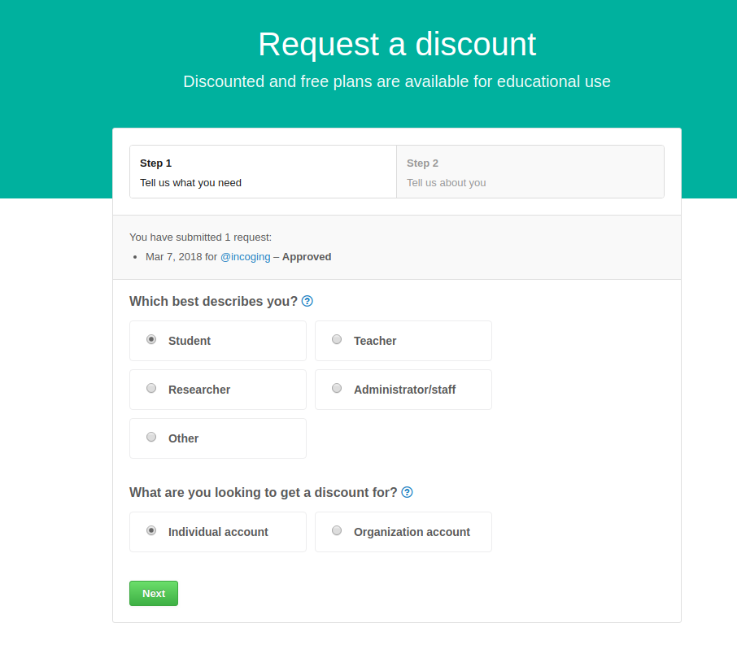

接着填写下面的信息：
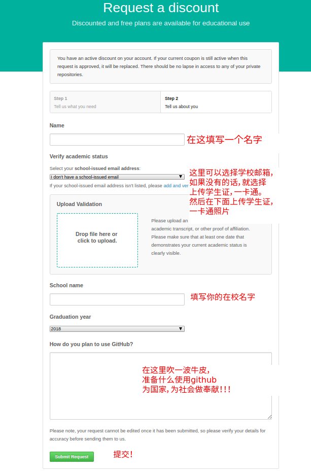

提交之后就等着吧，或许1天到两天就能接到申请了，happy。

##### 第二阶段：注册Digital Ocean账号

1.直接上网址：https://www.digitalocean.com/，可能有点慢，稍作等待。
打开后是这个样子：
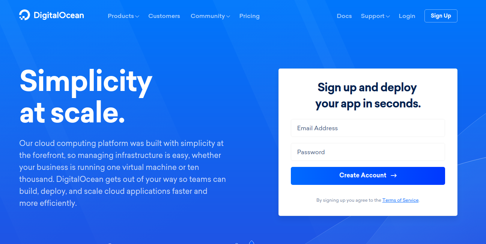

2.也是直接输入邮箱，密码，进行注册，之后会提示在你的邮箱里面发送一个链接，你就去你的邮箱完成进一步的认证：
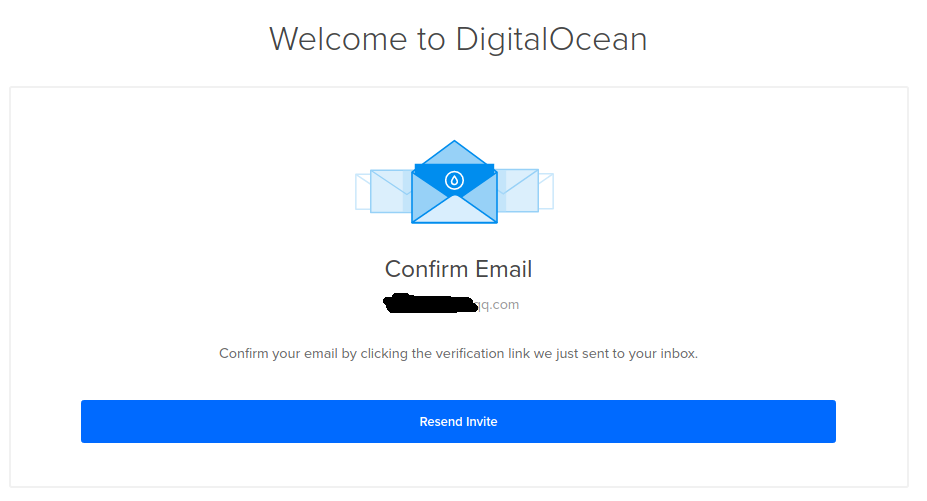

3.打开邮箱里面的链接后，会让你填写账单信息，如果你有信用卡，你可以选择信用卡，如果没有，那就和我一样选择PayPal
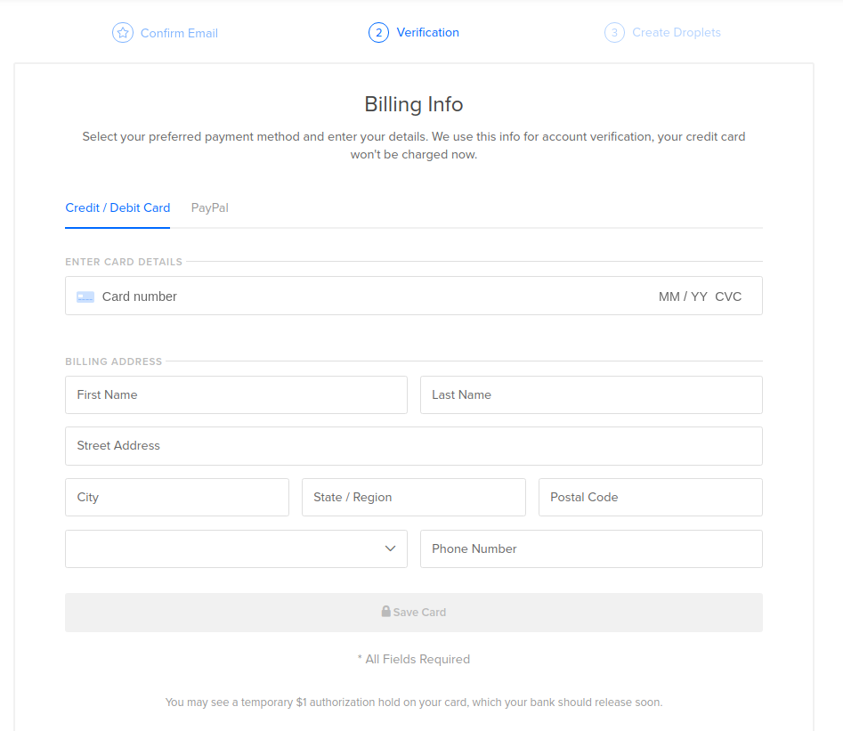

4.进入PayPal设置：
这个PayPal我也是第一次使用，不太了解，反正就是跟着提示往下点了，选择5美元。
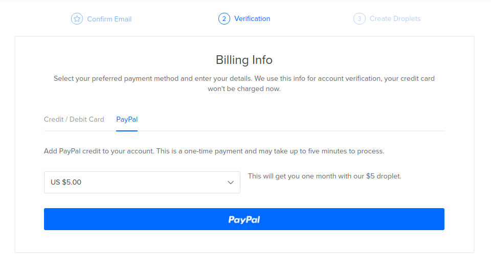

5.下一步：
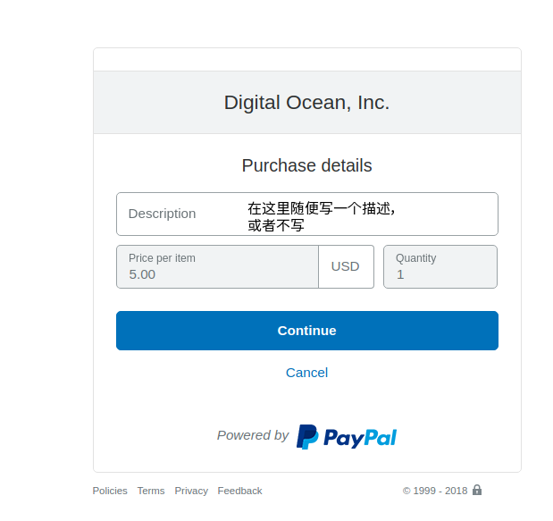

6.这里，如果你没有PayPal账号，那么你就另外打开一个窗口先申请一个PayPal账号，绑定上你的银行卡，（毕竟一会儿还要花钱呢）
登陆PayPal账号，这个界面其实就是和用支付宝的登陆买东西一样的，登陆，消费，就是这么粗暴。
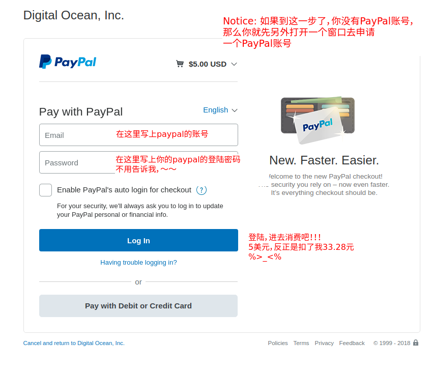

##### 第三阶段，在digitalocean上使用github送的福利，学生优惠券码

这个券原来100刀呢，现在只有50刀了。

1.直接上图！还是打开githubEducation网站：https://education.github.com/


2.打开后找到digitalocean这一栏，是酱紫滴：

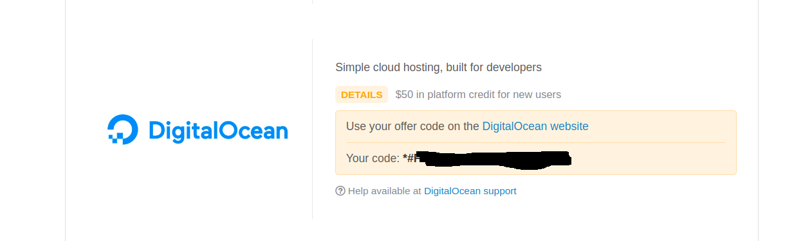

>上面有一个优惠券码

3.现在去digitalocean，填写这个券码
用前面注册的digitalocean账号登陆，再放一边网址：https://www.digitalocean.com/
进去之后右边有个头像的小人人，点开菜单，有Settings，我记得是在Billing这一栏，
在这里面找到promo code（因为我的填写完了，现在去截图，发现找不到了），然后填写你在github上复制的优惠码
爽歪歪，50美元账户到手。
下面将要真正的开始搭建服务器之旅！

#### 第四阶段：搭建远程服务器

1.登陆digitalocean，找到右边头像小人人左边的Create。没错，就是点它。然后选择Droplets

2.这一步建议先阅读文字， 下面也有贴图
开始下面的选项，我选择的是Ubuntu16.04x64的，然后规格选的是$5/month
下面的选择数据中心区域，这个大家可以在这个网站上进行测速，哪个好，你选哪个。

```
服务器测速网址“http://speedtest-fra1.digitalocean.com/”
```
然后是选择额外选项，记的勾选ipv6。
再下面是添加SSH keys，
这个呢，估计又得介绍一大堆，我用的直接就是linux，之前也建立过ssh，
windows还没试过，这个大家要不自行百度？
先介绍一下linux怎么弄吧：
> 2.1 首先查看用户的主目录下有没有.ssh目录，（一般是隐藏的，可以用ls -a 查看）
      且子目录中是否由id_rsa和id_rea.pub这两个文件，若有则跳过下面命令，
      若没有，执行下面命令:
```
ssh-keygen -t rsa -C "youremail@example.com"  # 邮箱地址替换成github注册的邮箱地址
```
> 之后一直回车键就可以了。
  结果可以在/home/用户主目录下的.ssh目录中找到id_rsa(私钥，不能泄露)和id_rea.pub(公钥)。
  一会要在DigitalOcean里面添加的就是公钥。
  
>  2.2 用vim打开id_rea.pub用以复制，没用过vim也没关系，很简单
```
# 假设现在在/home/用户主目录下，进一步打开.ssh目录
cd .ssh
vim id_rea.pub
# 然后鼠标选中那一大长串子，（记的选中完）然后鼠标右键copy就行了。
```

复制完之后在刚才create Droplets的页面点击 New SSH key, 在上面输入内容，在下面起一个名字，就可以了，然后
choose a hostname，就是为这个远程服务器起一个主机名，随便起，比如：wohenshuai，meidehen

Create!
下面贴图：

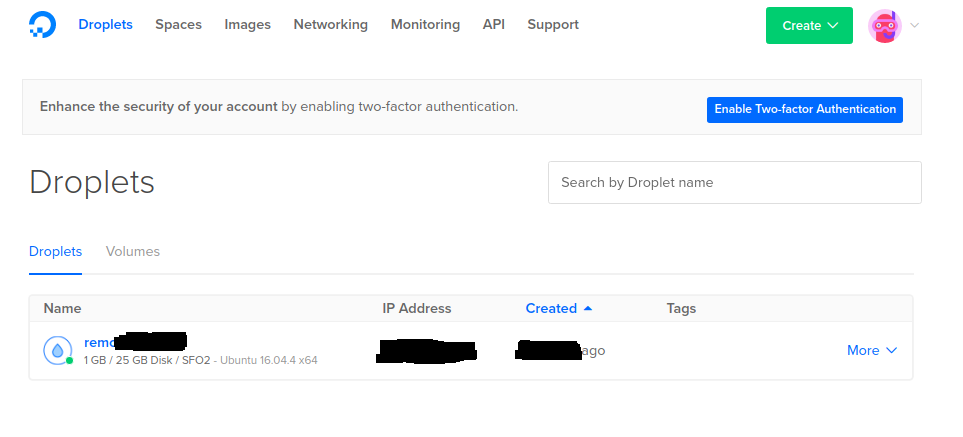
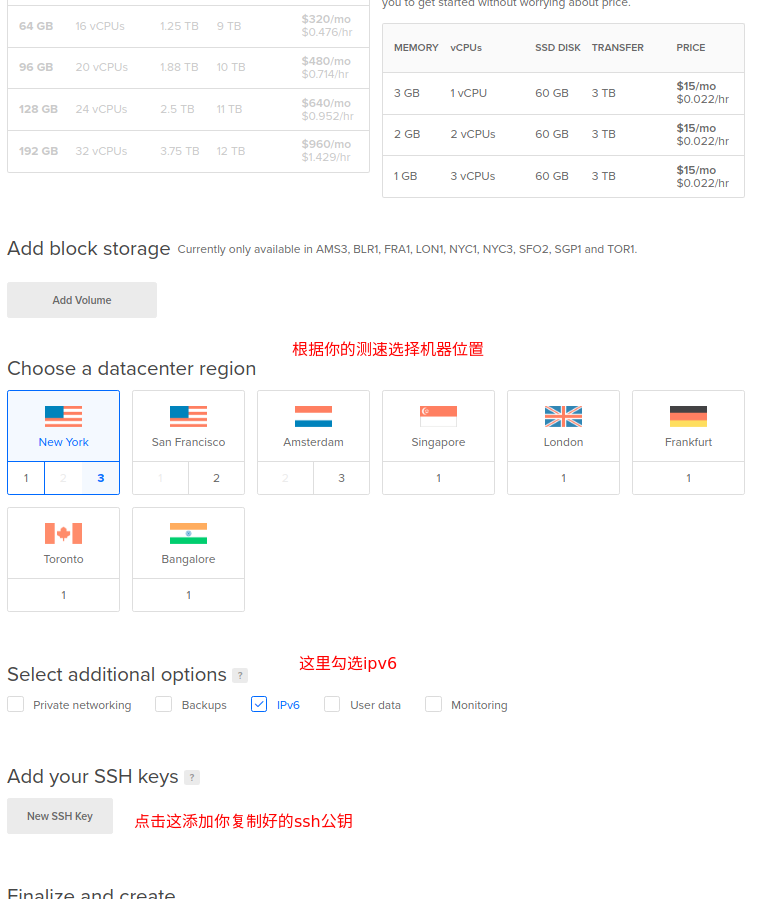

ok,创建好了，好了之后点击上面的Droplets是这个页面：


然后重置你的Root密码，就是点开上面的图片你的主机名，之后点击左侧的Access，右边有“Reset root password”
之后就会通过邮件的方式发送到你注册的那个邮箱，接着，你就可以通过下面命令进行远程登陆：
```
ssh root@ip  # 这个ip就是你创建好远程主机之后分配给你的ip，在Droplets那个页面一下就能看到
```
我记得第一次登陆的时候我根据重置的密码重新修改了密码，现在具体的步骤给忘了，尴尬。。。 大家自己摸索一下。

##### 第五阶段：安装配置ShadowSocks

1.上面你已经连接到主机页面了，没连接的话，使用下面命令
```
ssh root@ip  # 这个ip就是你创建好远程主机之后分配给你的ip，在Droplets那个页面一下就能看到
```

2.在远程服务器安装ShadowSocks
```
# apt-get update                              // 更新源
# apt-get install python-pip                  // 安装pip
# pip install --upgrade pip                   // 更新pip,这一步可能会报错，
                                                 unsupported locale setting, 那么就先看下面的解决方案再执行这一步
# apt-get install git
# pip install git+https://github.com/shadowsocks/shadowsocks.git@master   // 安装SS
```
解决pip报错：unsupported locale setting，好解决，两行命令：
```
locale
export LC_ALL="C"
```

3.安装chacha20加密方式

直接按照下面的命令，一句一句的疯狂执行就行了
```
# apt-get install build-essential
# wget https://github.com/jedisct1/libsodium/releases/download/1.0.8/libsodium-1.0.8.tar.gz
# tar xf libsodium-1.0.8.tar.gz && cd libsodium-1.0.8
# ./configure && make -j2
# make install
# ldconfig
```

4.配置ShadowSocks
先建立一个json文件，然后在json文件中设置你的密码啊，端口啊啥的。
```
vim /etc/shadowsocks.json  # 新建并通过vim打开一个json文件
```

在这个json文件中输入(先看下面的Notice)：

```
"server":"your_server_ip",    
    "server_port":8388,  
    "local_address": "127.0.0.1",  
    "local_port":1080,  
    "password":"your_password",  
    "timeout":300,  
    "method":"chacha20",  
    "fast_open": false  

```
> Notice： your_server_ip 就是你刚才建立的远程服务器的ip
           your_password 就是一会儿你在你自己电脑上连接这个ss时候要输入的密码
           记住你设置的server_port端口号，一会儿要用
接着，开始启动远程服务器的ss：
```
ssserver -c /etc/shadowsocks.json -d start
```
ok,这样就行了，下面就可以开始配置你自己的电脑用来连接了。

同时，也附上让ss停止运行的命令：
```
ssserver -c /etc/shadowsocks.json -d stop
```

##### 第六阶段：配置自己电脑的shadowsocks

1.这里先教linux的吧   
1.1 我用的是Ubuntu16.04，不想通过命令设置了，就直接安装个客户端吧
命令如下：(简单粗暴，直接一步一步来)
```
sudo add-apt-repository ppa:hzwhuang/ss-qt5
sudo apt-get update
sudo apt-get install shadowsocks-qt5
```
1.2 安装完之后打开客户端，直接在窗口下面空白地方右键Add-\>manually
接着，再上图：

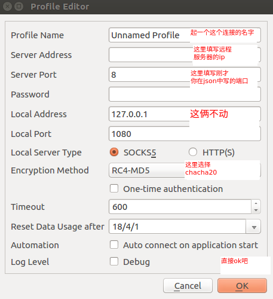

1.3 按照以上进行设置后，点击connect,还有，还有就是配置浏览器，我用的是chrome，需要给chrome安装
SwitchyOmega插件，因为现在还不能翻墙，所以就去Github上下载吧，地址：

```
https://github.com/FelisCatus/SwitchyOmega/releases/ 
```
然后在chrome里面右上角菜单，More tools->Extensions, 把下载好的插件拖进去。

1.4 安装好插件后，进入插件的设置选项，有提示你可以跳过。
在左边New profile->选择Proxy Profile->随便起一个名字我起的是：ShadowSocks，然后创建，
在代理协议选择SOCKS5，地址为127.0.0.1,端口默认1080。然后应用选项。
现在，now，都已经配置好了，开始上网吧！！！

2.现在开始windows

同样，我也是下载了windows的shadowsocks客户端。
windows我没有现下，因为我之前就有，回头我放一个百度云盘的链接吧，没有的从我这里下
pass  # 这里留作放链接
下载后打开shadowsocks.exe，点击添加，按照下图进行配置：
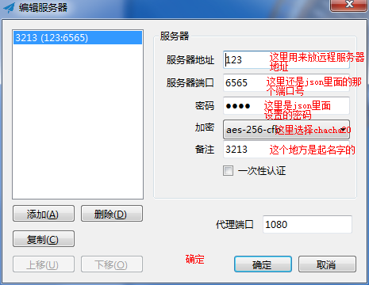

然后在任务栏这个小飞机上点击右键，选择全局代理，浏览器不用再配置，就能直接上Google等。
如果不想使用全局代理，那么就按照上面linux中浏览器配置环节进行配置吧。

====================================================================

以上，应该能正确上网了，但是还达不到youtube 720p甚至1080p无卡顿，那么就来吧，继续配置远程服务器

#### 第七阶段：开启谷歌BBR优化

1.登陆到远程服务器
```
ssh root@ip  # 这个ip就是你创建好远程主机之后分配给你的ip，在Droplets那个页面一下就能看到
```
2.下载并安装4.9内核，因为4.9内核支持TCP BBR。
```
wget http://kernel.ubuntu.com/~kernel-ppa/mainline/v4.9-rc8/linux-image-4.9.0-040900rc8-generic_4.9.0-040900rc8.201612051443_amd64.deb

dpkg -i linux-image-4.9.0*.deb  # 安装3.9内核，过程中会提示是否保留原始文件安装啥的，不要选择那个，选安装新的
                                  具体是什么给忘了，如果遇到了，不知道选哪个，那就百度吧。。。

dpkg -l|grep linux-image  # 查看当前系统中的内核状态                                  
sudo apt-get remove linux-image-[Tab补全]  # 删旧内核，我删除的是4.4的
update-grub  # 更新系统引导文件
reboot  # 重启
```

3.因为远程服务器重启了，所以需要按照第一步重新登陆，登陆后准备开启BBR

直接上命令：
```
echo "net.core.default_qdisc=fq" >> /etc/sysctl.conf
echo "net.ipv4.tcp_congestion_control=bbr" >> /etc/sysctl.conf

sysctl -p
sysctl net.ipv4.tcp_available_congestion_control  # 如果结果中有 bbr, 则证明你的内核已开启bbr
lsmod | grep bbr  # 如果看到有 tcp_bbr模块，即说明bbr已启动。
```
ok，所有的都结束了，至少我试了试720p确实不卡。不过我是晚上实验的，可能是用的人少了？

以上均为从网上查找的内容，只是进行了整理，仅供自己记录和周围同学学习练习。

